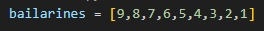
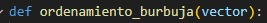
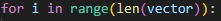
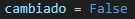
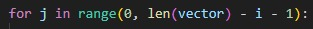
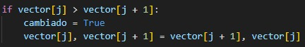
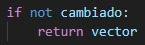
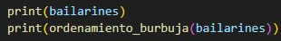

# TP Ordenamiento 

## :busts_in_silhouette: Integrantes 
- Pablo Chevetzki
- Sebastián Javier Andreozzi
- Julián Nairo

## :page_with_curl: Consignas
- [Consignas](./doc/TP%20Ordenamiento.pdf)

## Punto 1

### Analizar el algoritmo “Quicksort” dado en clases, indicando paso a paso qué hace el algoritmo

Primero se inicializa la variable en 0, luego la función swap toma dos argumentos (a, b) y retorna una tupla (b, a), para intercambiar los valores de a y b.

Se define la fución "particionar".
Se elige el último elemento del subarray como pivote.
Se inicializa el contador en (low - 1).
Se recorre el subarray desde low hasta high - 1.
Se intercambian los elementos, si el elemento actual array[j] es menor o igual al pivote, se incrementa i y se intercambian array[i] y array[j].
Luego del bucle, se coloca el pivote en su posición correcta intercambiando array[i + 1] con array[high].
Se retorna el índice del pivote (i + 1).

Luego se define la función "quick_sort".
Se incrementa c en 1 cada vez que se llama a quick_sort.
Si low es menor que high, se procede a particionar el array.
Se llama a particionar y se obtiene el índice pi del pivote.

Se llama recursivamente a quick_sort para el subarray a la izquierda del pivote (low a pi - 1).
Se llama recursivamente a quick_sort para el subarray a la derecha del pivote (pi + 1 a high).

### ¿Se les ocurre alguna forma de implementar el algoritmo sin utilizar recursión?

Se nos ocurre utilizar una lista para almacenar los índices de las sublistas.

### ¿Notan diferencias en cuanto a performance? ¿Cuáles?
En ejecucion es probable que ambas versiones tengan un rendimiento similar en la mayoría de los casos. 
Sin embargo, la versión iterativa es preferible utilizarla cuando el tamaño de la lista es grande y existe el riesgo de desbordamiento de la pila. 
La versión recursiva es más sencilla y más comúnmente utilizada debido a que es mas simple y clara.

## Punto 2

### 1. Ver el video de la coreografía que simula el ordenamiento de vectores y tomar nota de los pasos clave observados durante el proceso.

El video muestra una coreografía de danza folclórica húngara para ilustrar el algoritmo de ordenamiento de burbuja. Pasos clave que observamos:

Los bailarines representan elementos de un vector. Se comparan parejas adyacentes y, si están desordenadas, se intercambian las posiciones.
Se mueven los elementos mayores hacia el final del vector en cada pasada.
A medida que va avanzando la coreografía se van comparando con el bailarin/a de su izquierda e intercambiando posiciónes si el primero es mayor que el segundo hasta que todo el vector esté ordenado.

### 2. Basándote en la coreografía, formalizar un algoritmo que represente la estrategia utilizada para ordenar los elementos del vector.

~~~ Python
  bailarines = [9,8,7,6,5,4,3,2,1]

  def ordenamiento_burbuja(vector):

      for i in range(len(vector)):

          cambiado = False
          for j in range(0, len(vector) - i - 1):

              if vector[j] > vector[j + 1]:
                  cambiado = True
                  vector[j], vector[j + 1] = vector[j + 1], vector[j]

          if not cambiado:
              return vector

  print(bailarines)
  print(ordenamiento_burbuja(bailarines))
~~~

### 3. Describir detalladamente cada paso del algoritmo, incluyendo las operaciones realizadas en cada etapa.

Se define una lista llamada bailarines con los elementos [3, 0, 1, 8, 7, 2, 5, 4, 6, 9].

Se define una función ordenamiento_burbuja que toma como argumento un vector.

Se inicia un bucle for que va desde i = 0 hasta i = len(vector) - 1. Este controla el número de pasadas a través de la lista.

Se establece una bandera cambiado en False al comienzo de cada pasada. Esta bandera se utiliza para detectar si se han realizado intercambios en la pasada actual.

Se inicia un bucle for que va desde j = 0 hasta j = len(vector) - i - 2. Este controla las comparaciones e intercambios dentro de cada pasada. 
La longitud del bucle va disminuyendo con cada pasada ya que los elementos más grandes se "burbujearán" hacia el final de la lista.

Se compara vector[j] con vector[j + 1]. Si vector[j] es mayor, se realiza un intercambio de los elementos.
Se cambia la bandera cambiado a True para indicar que se ha realizado un intercambio.

Después de completar el bucle, se verifica la bandera cambiado.
Si no se realizaron intercambios, es decir (cambiado es False), la lista ya está ordenada y se retorna el vector ordenado.

Se imprime la lista original bailarines.
Se llama a la función ordenamiento_burbuja con la lista bailarines y se imprime el resultado.

### 3.4 Realizar un análisis comparativo entre el algoritmo formalizado y otros algoritmos de ordenamiento vistos (por ejemplo, burbuja y selección).

Los tres algoritmos tienen ventajas y desventajas entre si, pero difieren en su facilidad de implementación, estabilidad y adaptabilidad. 
El algoritmo de burbuja y el de selección son más fáciles de entender y más estables en comparación con el algoritmo formalizado. 
El algoritmo formalizado es más conveniente usarlo en problemas específicos donde tenga más sentido por su lógica.

### 3.5 Discutir las ventajas y desventajas del algoritmo propuesto en términos de tiempo de ejecución, número de comparaciones necesarias y complejidad en el peor caso.

Ventajas: el algoritmo de ordenamiento burbuja es adecuado para conjuntos de datos pequeños o cuando la simplicidad es prioritaria sobre la eficiencia.

Desventajas: para conjuntos de datos mas grandes, otro algoritmo, como el "quicksort", es generalmente preferible debido a su rendimiento en tiempo de ejecución y número de comparaciones.

### 3.6 Presentar las conclusiones y reflexiones sobre la efectividad y eficiencia del algoritmo propuesto en relación con los objetivos de ordenamiento.

Es efectivo ya que logra ordenar el vector correctamente. Por lo que en términos de precisión, cumple el rol esperado.
En terminos de eficiencia es más limitado. Para grupos pequeños como el proporcionado, esto no es un gran problema. 
Pero para grupos mas grandes el tiempo de ejecucion se haria claramente muy largo. Por lo que seria recomendable usar la tecnica de ordenamiento quicksort.